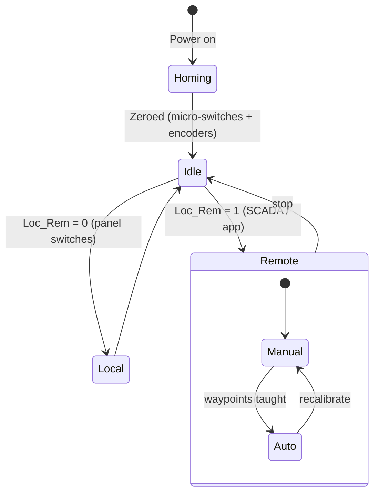
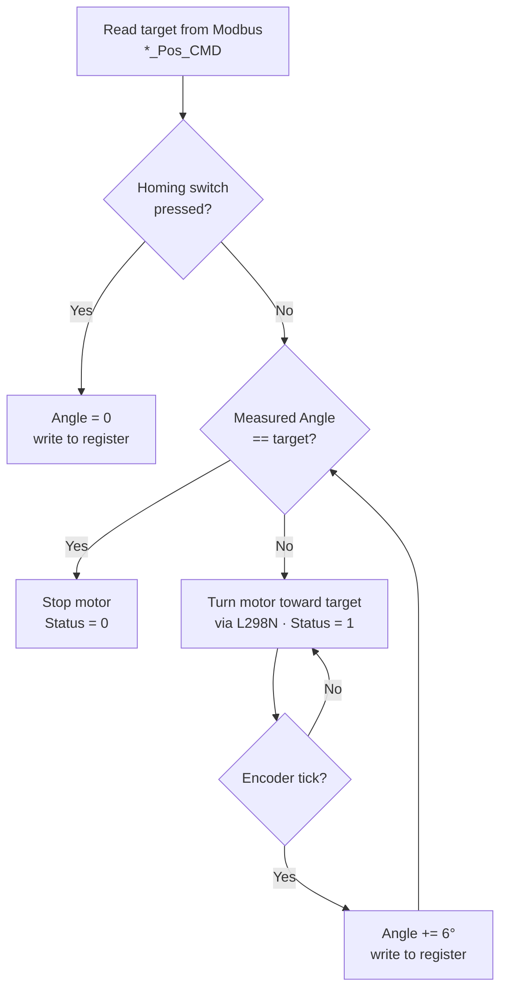
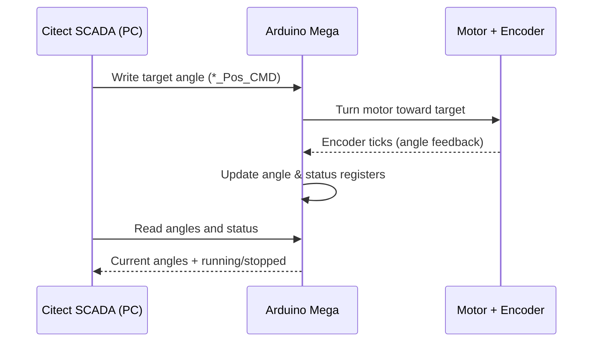

# 6-DOF Robotic Manipulator — Modbus & CAN Control


A robotic arm with 6 moving joints, controlled with the Modbus and CAN protocols used in
factory automation. An Arduino runs the arm and moves its motors, while software on a PC
(Citect SCADA) is used to watch and control it. The arm can also be driven from a phone
over Bluetooth.

This is my B.Sc. project at the School of Electrical & Computer Engineering, University of
Tehran (2023), done in the Industrial Automation & Intelligent Processing Lab. It builds on
an earlier lab arm by adding the CAN connection and phone control.

## Features

- A robotic arm with 6 moving joints and a gripper hand to pick things up
- Runs on an Arduino that talks to PC software (Citect SCADA) using the Modbus industrial protocol
- A second Arduino connects over the CAN bus, another common industrial protocol
- Can also be controlled from a phone over Bluetooth
- Two ways to run it: move each joint by hand with buttons, or give it a target and let it go there on its own
- Sensors track each joint's angle and detect shaking, so it moves smoothly and accurately
- A safety circuit physically stops the arm from going too far, even if the software fails
- Finds its own starting position every time it powers on

## System Architecture

The PC software and the phone app sit at the top and send commands. The main Arduino (a
Mega) receives them, moves the motors through an L298N driver board, and reads the sensors.
A second Arduino (an Uno) is connected over CAN using two MCP2515 boards, and an HC-05
module handles the Bluetooth link to the phone.


## Control Modes

The arm can be run in two main ways:

| Mode | What it does |
|------|--------------|
| **Local control** | The arm is driven from switches mounted right on the robot. |
| **Remote control** | The arm is driven from the PC software or the phone app. It has two sub-modes: |
| &nbsp;&nbsp;• *Manual* | Move each joint yourself with on-screen buttons. Handy for setup and for teaching positions. |
| &nbsp;&nbsp;• *Auto* | Give the arm target angles and it moves there on its own. |

When it powers on, the arm first moves to its starting position using small switches and the
sensors. A simple hardware circuit sets hard limits on how far each joint can turn, so the
arm stays safe even if the software goes wrong. The gripper at the tip picks up and moves a
box-shaped object on an assembly line.



## Kinematics

The arm is made of five rotating joints plus one that slides (an R‑R‑R‑R‑R‑P layout). To
work out where the gripper ends up from the joint angles, it uses the standard
Denavit–Hartenberg (DH) method. Each joint is described by four numbers (its angle *θ*,
offset *d*, length *a*, and twist *α*), and this matrix links one joint to the next:

$$
T_i^{\,i-1} =
\begin{bmatrix}
\cos\theta_i & -\sin\theta_i\cos\alpha_i & \sin\theta_i\sin\alpha_i & a_i\cos\theta_i \\
\sin\theta_i & \cos\theta_i\cos\alpha_i & -\cos\theta_i\sin\alpha_i & a_i\sin\theta_i \\
0 & \sin\alpha_i & \cos\alpha_i & d_i \\
0 & 0 & 0 & 1
\end{bmatrix}
$$

Multiplying these together from the base out to the tip gives the gripper's position from
the joint angles reported over Modbus (`Angle1`–`Angle3` and the stepper position).

## Hardware

| Qty | Component | What it's for |
|----:|-----------|---------------|
| 1 | Arduino Mega 2560 | Main board that runs the arm and talks over Modbus |
| 1 | Arduino Uno | Second board on the CAN connection |
| 1 | L298N V3 | Driver board that powers the DC motors |
| 3 | DC gear-motors (with encoders) | Turn the main joints; the encoders report the angle |
| 1 | Stepper motor (5-wire) | Drives the sliding / gripper axis |
| 2 | Servo motors | Gripper and wrist |
| 3 | Piezo vibration sensors | Detect shaking on the arm |
| 4+ | Micro-switches | Mark the start position and end limits |
| 2 | MCP2515 CAN module | Connect the two Arduinos over CAN |
| 1 | HC-05 | Bluetooth link to the phone |
| 1 | RS-485 transceiver (MAX485 / shield) | Carries the Modbus signal |

Plus terminals, the safety circuit, and wiring (see the diagrams below). The gripper is an
aluminum two-finger hand moved by a servo.

## Communication Protocols

- **Modbus** (over RS-485) connects the Arduino and the PC software (9600 baud, slave ID 1).
  It reads and writes the Arduino's registers.
- **CAN bus** connects the two Arduinos through the MCP2515 boards (up to 1 Mbit/s).
- **Bluetooth** (HC-05) lets the phone control the arm through the Dabble app.
- The wider lab line also uses AS-i and Profibus with a PLC, but those aren't part of this
  project.

## Pin Mapping (Arduino Mega)

Which Arduino pin does what, taken from the code. The motor pins are outputs; the sensor
and switch pins are inputs.

| Function | Pin(s) | Direction |
|----------|--------|-----------|
| Main motor — IN1 / IN2 / EN | 0 / 1 / 3 | out |
| Motor 2 — IN1 / IN2 / EN | 2 / 7 / 5 | out |
| Motor 3 — IN1 / IN2 / EN | 14 / 15 / 6 | out |
| Stepper — IN1 / IN2 / IN3 / IN4 | 10 / 11 / 12 / 13 | out |
| Encoder pulse — Main / A2 / A3 | 16 / 17 / 18 | in |
| Homing switch — Main / A2 / A3 | 9 / 19 / 4 | in |
| Stepper homing switch | 8 | in |
| Servo 1 | 23 | out |

> These pin numbers come straight from the `#define` block in the code. Note the main-motor
> pins reuse the Mega's serial pins (0/1) that Modbus also uses, so move them to spare pins
> if you rewire from scratch.

## Modbus Register Map

The PC software talks to the arm through a list of registers. The master (PC) writes
command registers, and reads back the position and status registers. Use the address
numbers below directly when setting up the SCADA tags.

| Addr | Register | Direction | Meaning |
|-----:|----------|-----------|---------|
| 0 | `Main_Motor_CMD` | write | Main motor jog (+/- direction) |
| 1 | `Motor2_CMD` | write | Joint-2 jog |
| 2 | `Motor3_CMD` | write | Joint-3 jog |
| 3 | `StepperMotor_CMD` | write | Stepper jog |
| 4 | `Main_Motor_Pos_CMD` | write | Main motor target angle (auto) |
| 5 | `Motor2_Pos_CMD` | write | Joint-2 target angle (auto) |
| 6 | `Motor3_Pos_CMD` | write | Joint-3 target angle (auto) |
| 7 | `StepperMotor_Pos_CMD` | write | Stepper target position (auto) |
| 8 | `Angle1` | read | Measured main angle |
| 9 | `Angle2` | read | Measured joint-2 angle |
| 10 | `Angle3` | read | Measured joint-3 angle |
| 11 | `Position4` | read | Gripper position |
| 12 | `StepperMotor_Pos` | read | Stepper position |
| 13 | `Man_Auto` | write | 0 = manual, 1 = auto |
| 14–17 | `*_Status` | read | Each motor: running (1) or stopped (0) |
| 18 | `Loc_Rem` | write | 0 = local, 1 = remote |
| 19 | `servo1_CMD` | write | Servo command |
| 20 | `TOTAL_ERRORS` | read | Count of communication errors |

Settings: 9600 baud, slave ID 1, transmit-enable on pin 6 (`modbus_configure(9600, 1, 6, …)`).
Full logic is in [`firmware/Manipulator_970818.ino`](firmware/Manipulator_970818.ino).

## Control Flow & Data Path

**How a joint reaches its target (auto mode).** The motor keeps turning toward the target
angle. Each time the encoder ticks, the measured angle goes up by 6°, until it matches the
target:



**Sending commands and reading feedback.** The PC sends target angles and keeps reading
back the live angles and status:



## SCADA HMI

The PC software project (`scada/robot_arm_11.ctz`) has a control panel with separate Manual
and Auto sections, live angle readouts, a status light per motor, and a moving picture of
the arm.


> `.ctz` is a Citect SCADA project file — open it with AVEVA/Schneider Electric Citect SCADA
> (Citect Explorer → *Restore*).

## Wiring

**Motors, stepper and servos → L298N driver / terminals → Arduino Mega**


**Encoders and vibration sensors → Arduino Mega**


## Repository Layout

```
.
├── firmware/
│   └── Manipulator_970818.ino   # Arduino Mega code (runs the arm over Modbus)
├── scada/
│   └── robot_arm_11.ctz         # Citect SCADA project (PC control panel)
├── docs/
│   └── images/                  # Architecture, control panel, and wiring diagrams
└── README.md
```

## Building & Flashing

1. Install the [Arduino IDE](https://www.arduino.cc/en/software).
2. Install the needed libraries: SimpleModbusSlave and the built-in Stepper library.
3. Open `firmware/Manipulator_970818.ino`, choose Arduino Mega 2560, and upload.
4. Connect the RS-485 wiring, set up the Citect SCADA project as the Modbus master
   (slave ID 1, 9600 baud), and restore `scada/robot_arm_11.ctz`.

## License

The code is based on Zihatec's RS422/RS485 shield example and the SimpleModbus library, and
is released under the GNU GPL v3 — see [LICENSE](LICENSE).

## References

- *Development of a Robotic Arm Control System Using CAN Protocol*
- *Optimization of CAN Communication for 6DOF Manipulator Control*

## Author

**Sina Mohebbi** — B.Sc. Electrical & Computer Engineering, University of Tehran.
Industrial Automation & Intelligent Processing Lab, 2023.
