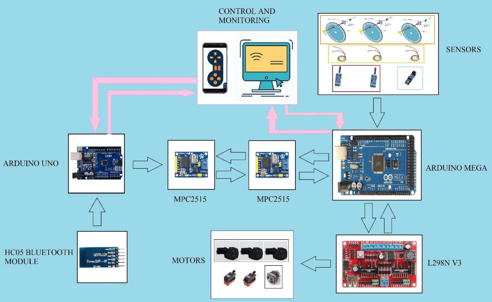
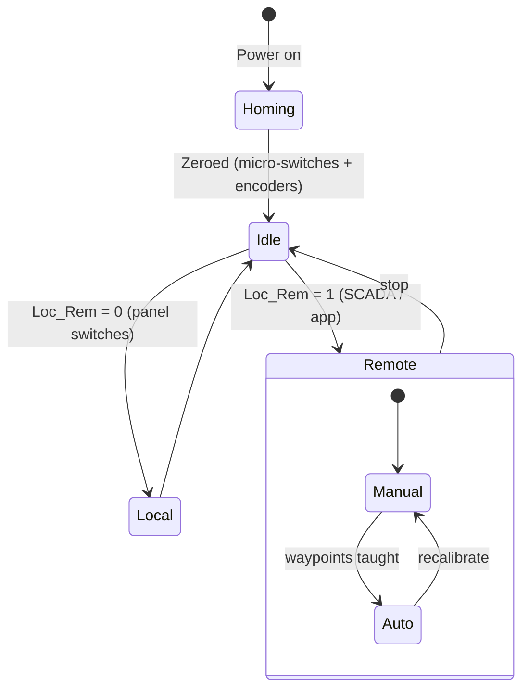
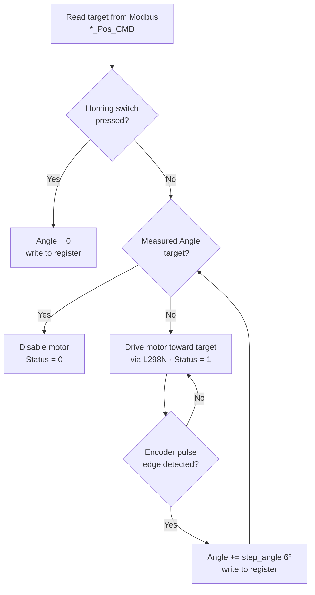
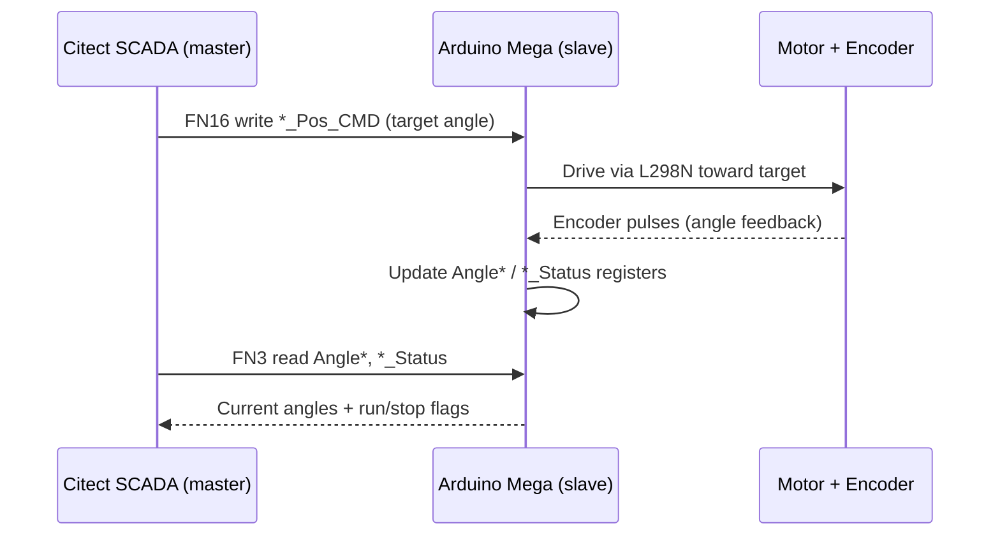
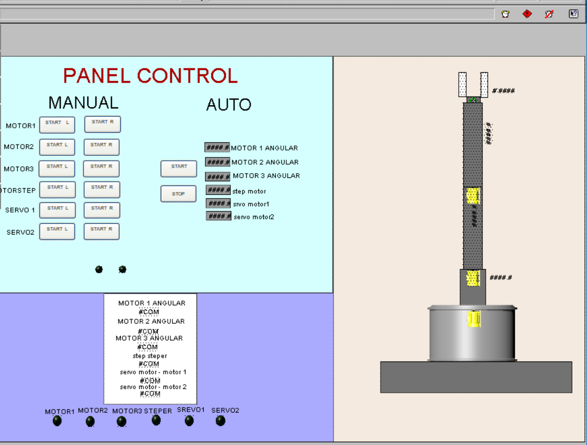
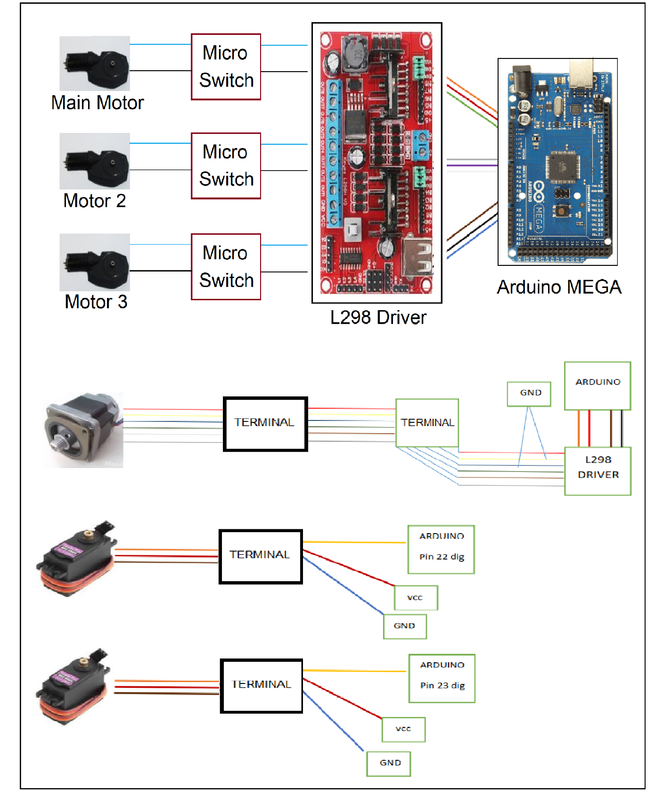
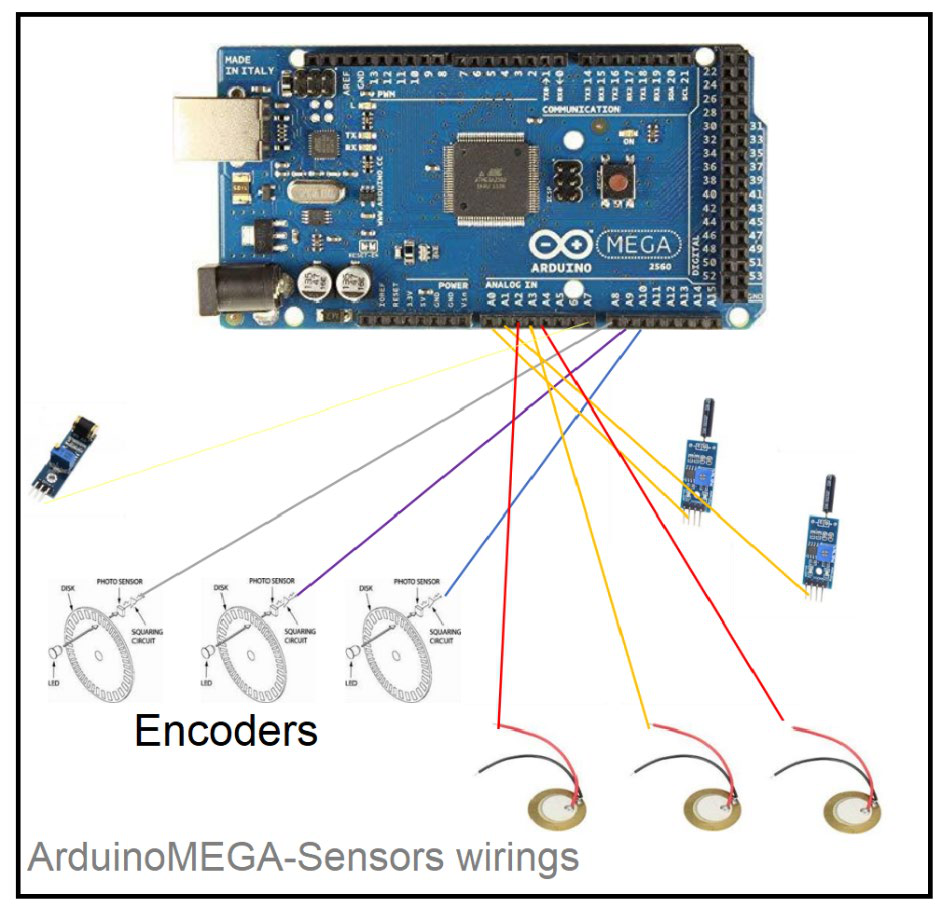

# 6-DOF Robotic Manipulator — Modbus & CAN Control


Control system for a 6 degree-of-freedom robotic arm built around the Modbus RTU and CAN
fieldbus protocols. An Arduino runs the arm as a Modbus slave, driving the DC motors,
stepper, servos and sensors, while a Citect SCADA master on a PC handles supervisory
control and monitoring. The arm can also be driven remotely over Bluetooth from a phone.

This is my B.Sc. project at the School of Electrical & Computer Engineering, University of
Tehran (2023), done in the Industrial Automation & Intelligent Processing Lab. It extends
an earlier lab manipulator by adding the CAN bus link and mobile remote control.

## Features

- A robotic arm with 6 moving joints and a gripper hand to pick things up
- Runs on an Arduino that talks to PC software (Citect SCADA) using the Modbus industrial protocol
- A second Arduino connects over the CAN bus, another common industrial protocol
- Can also be controlled from a phone over Bluetooth
- Two ways to run it: move each joint by hand with buttons, or give it a target and let it go there on its own
- Sensors track each joint's angle and detect shaking, so it moves smoothly and accurately
- A safety circuit physically stops the arm from going too far, even if the software fails
- Finds its own starting position every time it powers on

## System Architecture

The Citect SCADA PC and the mobile app sit at the top. The Arduino Mega runs the
manipulator as a Modbus slave and drives the motors through an L298N driver while reading
the encoders and piezo vibration sensors. A second Arduino Uno links in over CAN using two
MCP2515 transceivers, and an HC-05 module adds the Bluetooth remote link.



## Control Modes

The firmware has two top-level modes, selected over Modbus:

| Mode | Description |
|------|-------------|
| **Local control** | The arm is driven from switches mounted at the robot. |
| **Remote control** | Commanded from Citect SCADA or the mobile app. Has two sub-modes: |
| &nbsp;&nbsp;• *Manual* | Jog each joint with on-screen buttons. Used for calibration, homing and teaching waypoints. |
| &nbsp;&nbsp;• *Auto* | Send target joint angles/positions and the arm moves there on its own. |

On power-up the arm homes to its zero position using the micro-switches and encoders. A
hardware diode circuit enforces the angle limits, so the arm cannot travel past its safe
range even if the software goes wrong. A gripper at the end effector picks and places a
cubic object on an automation line.



## Kinematics

The arm has an R‑R‑R‑R‑R‑P configuration: five revolute joints for orientation plus one
prismatic joint before the gripper for linear reach. The forward kinematics use
Denavit–Hartenberg (DH) parameters, where each link is described by four values: joint
angle *θ*, link offset *d*, link length *a*, and link twist *α*. The homogeneous transform
between two consecutive links is:

$$
T_i^{\,i-1} =
\begin{bmatrix}
\cos\theta_i & -\sin\theta_i\cos\alpha_i & \sin\theta_i\sin\alpha_i & a_i\cos\theta_i \\
\sin\theta_i & \cos\theta_i\cos\alpha_i & -\cos\theta_i\sin\alpha_i & a_i\sin\theta_i \\
0 & \sin\alpha_i & \cos\alpha_i & d_i \\
0 & 0 & 0 & 1
\end{bmatrix}
$$

Chaining these transforms from base to end-effector gives the gripper pose from the joint
angles read back over Modbus (`Angle1`–`Angle3` and the stepper position).

## Hardware

| Qty | Component | Role |
|----:|-----------|------|
| 1 | Arduino Mega 2560 | Main controller / Modbus slave, motor & sensor I/O |
| 1 | Arduino Uno | Secondary node on the CAN bus |
| 1 | L298N V3 | Dual H-bridge driver for the DC motors |
| 3 | DC gear-motors (with optical encoders) | Main / joint-2 / joint-3 rotation, angle feedback |
| 1 | Stepper motor (5-wire) | Linear / gripper axis |
| 2 | Servo motors | Gripper & wrist |
| 3 | Piezo vibration sensors | Vibration sensing on the arm body |
| 4+ | Micro-switches | Homing / end-stop limits |
| 2 | MCP2515 CAN module | SPI-to-CAN transceiver |
| 1 | HC-05 | Bluetooth link for mobile remote control |
| 1 | RS-485 transceiver (MAX485 / shield) | Modbus physical layer |

Plus terminals, the diode safety circuit, and wiring (see the wiring diagrams below). The
end-effector is an aluminum parallel-jaw gripper actuated by a servo.

## Communication Protocols

- **Modbus RTU** over RS-485 links the Arduino slave and the Citect SCADA master
  (9600 baud, slave ID 1). Uses function 3 (read holding registers) and function 16
  (write multiple registers).
- **CAN bus** links the two Arduino nodes via MCP2515 (up to 1 Mbit/s).
- **TTL / Serial** and **Bluetooth (HC-05)** provide mobile remote control through the
  Dabble app.
- The wider lab automation line also uses AS-i and Profibus with a PLC (background from the
  thesis; not part of this repo).

## Pin Mapping (Arduino Mega)

Digital pins as defined in the firmware. DC-motor IN/EN pins drive the L298N; encoder pulse
and reset (homing switch) pins are inputs.

| Function | Pin(s) | Direction |
|----------|--------|-----------|
| Main motor — IN1 / IN2 / EN | 0 / 1 / 3 | out |
| Motor 2 — IN1 / IN2 / EN | 2 / 7 / 5 | out |
| Motor 3 — IN1 / IN2 / EN | 14 / 15 / 6 | out |
| Stepper — IN1 / IN2 / IN3 / IN4 | 10 / 11 / 12 / 13 | out |
| Encoder pulse — Main / A2 / A3 | 16 / 17 / 18 | in |
| Homing reset — Main / A2 / A3 | 9 / 19 / 4 | in |
| Stepper homing reset | 8 | in |
| Servo 1 | 23 | out |

> Pin numbers come straight from the `#define` block in the firmware and reflect the
> as-built wiring. The main-motor pins share the Mega's hardware `Serial0` (0/1) used by the
> Modbus link, so move them to free pins if you rewire from scratch.

## Modbus Register Map

The slave uses a single holding-register array (Modbus functions 3 and 16 share it).
Addresses are the zero-based index into that array, so use them directly as the register
addresses in the SCADA tag config. Command registers are written by the master;
status/position registers are read back.

| Addr | Register | Direction | Meaning |
|-----:|----------|-----------|---------|
| 0 | `Main_Motor_CMD` | write | Main motor jog (+/- direction) |
| 1 | `Motor2_CMD` | write | Joint-2 jog |
| 2 | `Motor3_CMD` | write | Joint-3 jog |
| 3 | `StepperMotor_CMD` | write | Stepper jog |
| 4 | `Main_Motor_Pos_CMD` | write | Main motor target angle (auto) |
| 5 | `Motor2_Pos_CMD` | write | Joint-2 target angle (auto) |
| 6 | `Motor3_Pos_CMD` | write | Joint-3 target angle (auto) |
| 7 | `StepperMotor_Pos_CMD` | write | Stepper target position (auto) |
| 8 | `Angle1` | read | Measured main angle |
| 9 | `Angle2` | read | Measured joint-2 angle |
| 10 | `Angle3` | read | Measured joint-3 angle |
| 11 | `Position4` | read | Gripper position |
| 12 | `StepperMotor_Pos` | read | Stepper position |
| 13 | `Man_Auto` | write | 0 = manual, 1 = auto |
| 14–17 | `*_Status` | read | Per-motor run (1) / stop (0) flags |
| 18 | `Loc_Rem` | write | 0 = local, 1 = remote |
| 19 | `servo1_CMD` | write | Servo command |
| 20 | `TOTAL_ERRORS` | read | Modbus error counter since start |

Slave config: 9600 baud, slave ID 1, TX-enable on pin 6 (`modbus_configure(9600, 1, 6, …)`).
See [`firmware/Manipulator_970818.ino`](firmware/Manipulator_970818.ino) for the full enum
and control logic.

## Control Flow & Data Path

**Closed-loop joint position control (auto mode).** Each DC joint drives toward its target
angle while the optical encoder increments the measured angle by `step_angle` (6° per
pulse) until the target is reached:



**Command & feedback round-trip.** The SCADA master writes setpoints and polls back the
live angles and status flags over Modbus:



## SCADA HMI

The Citect SCADA project (`scada/robot_arm_11.ctz`) has a Panel Control page with separate
Manual and Auto sections, live joint-angle readouts, per-motor status lamps, and an
animated view of the arm.



> `.ctz` is a Citect SCADA project backup — open it with AVEVA/Schneider Electric Citect
> SCADA (Citect Explorer → *Restore*).

## Wiring

**Motors, stepper & servos → L298N driver / terminals → Arduino Mega**



**Encoders & piezo vibration sensors → Arduino Mega**



## Repository Layout

```
.
├── firmware/
│   └── Manipulator_970818.ino   # Arduino Mega firmware (Modbus slave + motor/sensor logic)
├── scada/
│   └── robot_arm_11.ctz         # Citect SCADA supervisory project (HMI master)
├── docs/
│   └── images/                  # Architecture, HMI and wiring diagrams
└── README.md
```

## Building & Flashing

1. Install the [Arduino IDE](https://www.arduino.cc/en/software).
2. Install the required libraries: SimpleModbusSlave and the built-in Stepper library.
3. Open `firmware/Manipulator_970818.ino`, select Arduino Mega 2560, and upload.
4. Wire the RS-485 transceiver, connect the Citect SCADA project as a Modbus master
   (slave ID 1, 9600 baud), and restore `scada/robot_arm_11.ctz`.

## License

The firmware is based on Zihatec's RS422/RS485 shield example and the SimpleModbus library,
and is released under the GNU GPL v3 — see [LICENSE](LICENSE).

## References

- *Development of a Robotic Arm Control System Using CAN Protocol*
- *Optimization of CAN Communication for 6DOF Manipulator Control*

## Author

**Sina Mohebbi** — B.Sc. Electrical & Computer Engineering, University of Tehran.
Industrial Automation & Intelligent Processing Lab, 2023.
